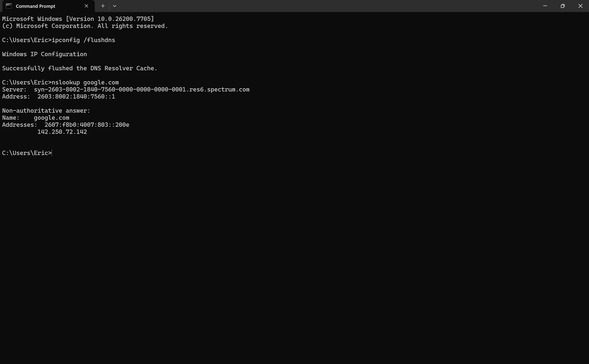
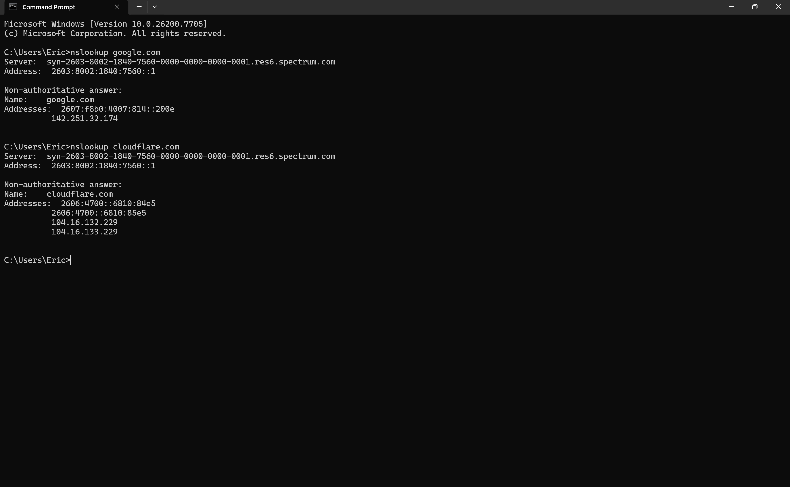
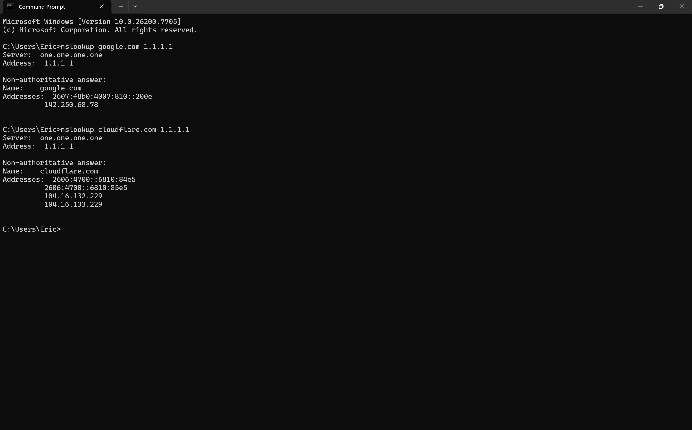

# Lab 03 — DNS Resolution & Caching

## Objective
Understand how DNS resolution works, compare different DNS resolvers, and observe caching/TTL behavior.

## Tools Used
- Windows Command Prompt
- `nslookup`
- `ipconfig`

---

## Part A — Baseline DNS Lookup (Default Resolver)

Run:
```powershell
nslookup google.com
nslookup cloudflare.com

## Screenshots

### Screenshot 1 — Flushed DNS + First Google Lookup


### Screenshot 2 — nslookup google.com using 1.1.1.1 Resolver


### Screenshot 3 — nslookup cloudflare.com using 1.1.1.1 Resolver



